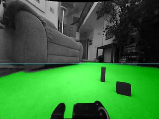
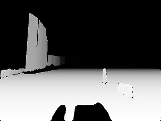
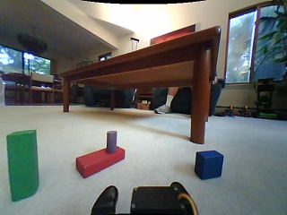
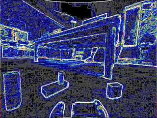
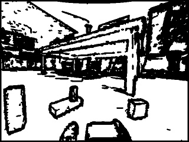
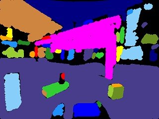
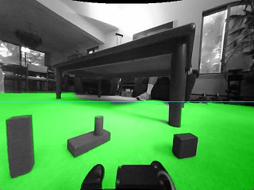
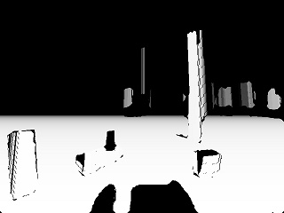

# rng_flr
## Metric Depth from Color Images

This library generates a partial frontal depth image from a single color input. Unlike some [neural network](https://github.com/NevermindNilas/Faster-Depth-Anything-V2/tree/main/metric_depth) approaches, the map has correct and consistent real-world distances. The library is also very fast (real-time video rate on PC) and can be used on embedded devices (e.g. Raspberry Pi 4 at 15Hz). The images below show the synthesized depth map and the extracted ground plane (with horizon line) that it is based on. The original input image was a 640x480 color scene.

| ground plane | depth map | 
| :---: | :---: |
|  |  |

The algorithm cannot reconstruct the whole scene, but instead _only_ focuses on aspects that are of use to a mobile robot. In particular, it attempts to find the nearby traversable floor region and objects poking up from this surface. This system was originally developed to enable navigation and manipulation on the [Baijiu](https://github.com/jconnell11/Baijiu) robot, which has no depth sensor, only a color webcam.

### Test Program

The program is hard-coded for the default pose of the Baijiu robot's camera: 5.5 inches off the ground and tilted 4.2 degrees upwards. It will look somewhat crazy when connected to a laptop camera, but you can still try it. Perhaps place your laptop on the floor with its screen vertical to get close to the same pose (assuming the camera is at the top of the bezel).

For Windows, start by copying [flr_test.exe](../project/flr_test.exe) executable and the 2 DLLs to some directory. Also include [opencv_world4100.dll](https://github.com/jconnell11/Baijiu/blob/main/project/DLL/opencv_world4100.dll) if OpenCV is not installed on the machine. Next, open up a terminal window, "cd" to this directory, and then enter the command below. The argument of 0 tells the system to use whatever camera is available instead of defaulting to the URL of the Baijiu robot's streaming camera.

    flr_test 0

For Linux, copy the naked [flr_test](../project/flr_test) to some location along with both shared libraries (.so files). As above, add [opencv_world4100.so](https://github.com/jconnell11/vid_ocv/blob/main/project/opencv_world4100.so) if needed. Finally "cd" to the new directory and enter the command:

    ./flr_test 0

In either case you should see two live windows (as above): one showing the ground plane and the other showing a grayscale version of the depth map. Note that, for both systems, the program needs the [vid_ocv](https://github.com/jconnell11/vid_ocv) library for grabbing and displaying images.

### Code Interface

There are a small number of [functions](../project/rng_flr.h) supported by the library. Examining the [source](../project/flr_test.cpp) code for the test program illustrates how to string them together. At the beginning call __rng_init__ and give it the dimensions of the (color) input images and the focal length of the camera (in pixels).

Next, start processing an input image (in a background thread) by calling __rng_est__. This takes a buffer of unsigned integer pixels in BGR color order scanned from left-to-right in a _bottom-up_ direction (the standard for Windows, where this library is mostly used). It is important that the input image is rectified (flattened) and rotated so "up" is directly vertical in the image. The [vid_ocv](../project/vid_ocv.h) library conveniently provides this functionality. 

Due to the nature of the analysis algorithm (see below), you also need to tell the function the "tilt" of the camera (in degrees) and the "ht" of the camera above the floor (in inches). Note that these may change over time if the camera is on some articulated appendage of the robot, like a pan-tilt head.

Finally, wait for the background thread to finish by checking __rng_rdy__. This can optionally be given a non-zero maximum wait time (in milliseconds) if you do not want to poll it. The final depth map can then be retrieved using __rng_d16__. Here, each unsigned 16 bit pixel tells the orthogonal offset of the corresponding point from the camera image plane in units of 0.02" (like an old Kinect 360). As with the input, this image is left-to-right but _bottom-up_. The function can also provide a cached copy of the input color image that was analyzed, if desired.

### Algorithm

This program leverages the assumption that the floor is _flat_ and of a _uniform_ color. It starts by segmenting the scene into homogeneous regions then selecting those areas likely to be floor. Because the camera's focal length, height, and tilt are all known, it can calculate the exact distance to each floor pixel. The images below show some of the intermediate steps.

| | |
|  :---:  | :---: |
| input | edges |
|     |        |
| separators | components |
|  |  |
| floor | depth |
|       |         |

It then exploits a second assumption: the floor generally _ends_ at obstacles which themselves have _vertical_ faces. So it scans up from the bottom of the image until the floor region stops, then progresses at an angle corresponding to true vertical at the ending floor pixel. As long as it remains within the first homegenous region encountered, it records a depth based on a sharp vertical rise from the floor. Notice that the system will not generate depth for the top of a block, nor will it find one object stacked on another.

### Compiling

If for some reason you want to recompile this library, the project files for [Visual C++ 2022](https://aka.ms/vs/17/release/vs_community.exe) Community (free) are included. Use rng_flr.sln for Windows, or rng_flr_ix.sln for Linux. The Linux version assumes you can connect to some remote machine with GCC and OpenCV 4.10 installed to do the compiling. The test program has similar solution files: flr_test.sln and flr_test_ix.sln. Note that there are quite a few source code files under video/ and robot/ which have been copied over from the [ALIA](https://github.com/jconnell11/ALIA) project.

---

October 2026 - Jonathan Connell - jconnell@alum.mit.edu